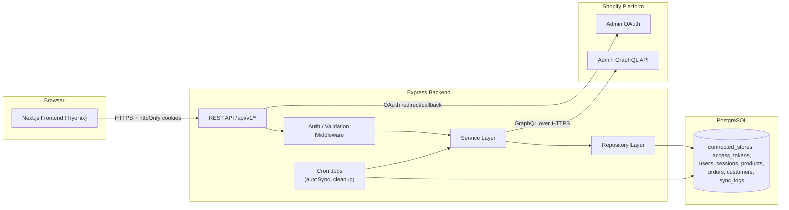
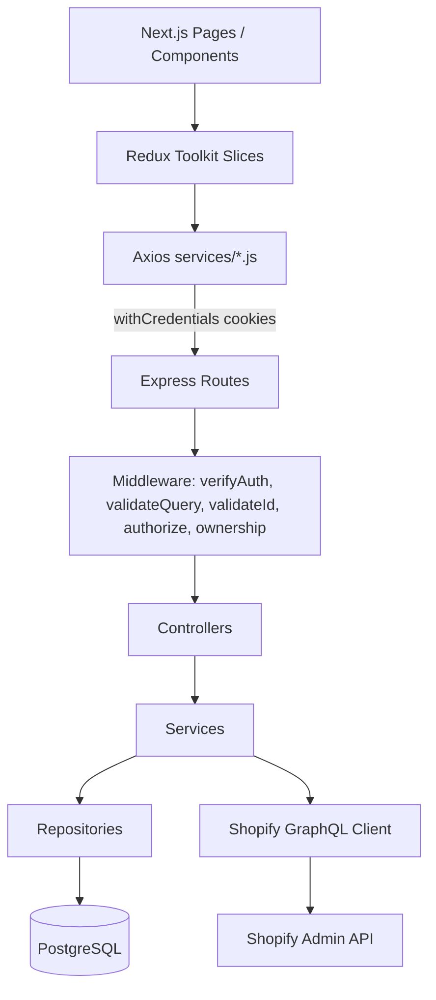
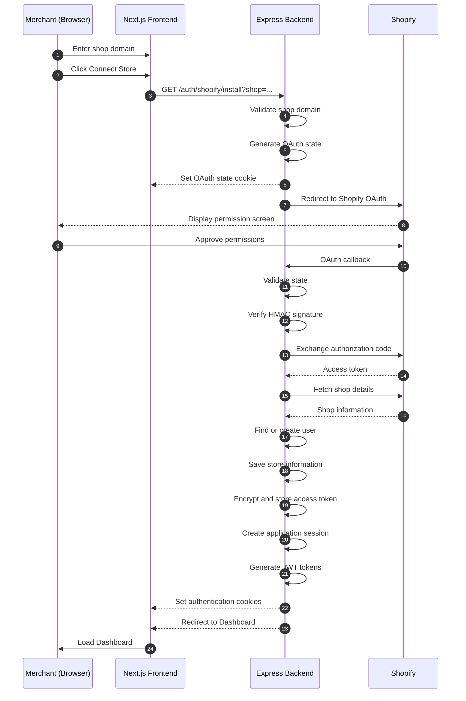
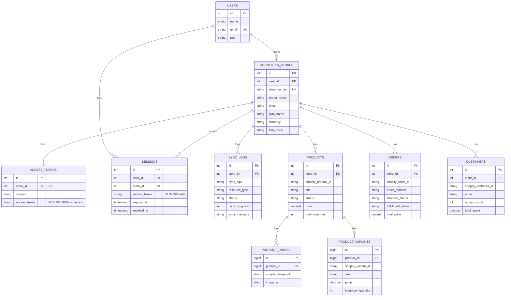
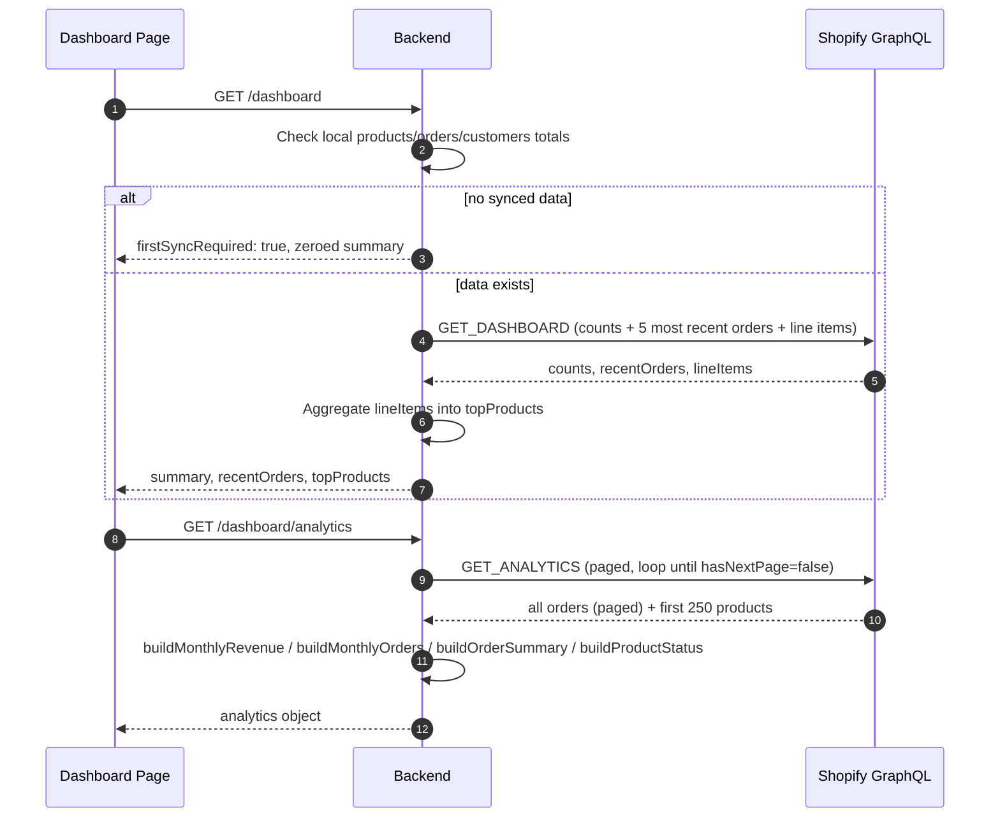

# Tryonix — Shopify Store Data Integration System

**Technical Project Documentation**

Version 1.0 · Prepared from source-code analysis of the backend (Node.js/Express API) and frontend (Next.js)

---

## Table of Contents

1. [Project Overview](#1-project-overview)
2. [System Architecture](#2-system-architecture)
3. [Technology Stack](#3-technology-stack)
4. [Project Structure](#4-project-structure)
5. [Shopify OAuth Authentication Flow](#5-shopify-oauth-authentication-flow)
6. [Authentication & Security](#6-authentication--security)
7. [Database Design](#7-database-design)
8. [API Documentation](#8-api-documentation)
9. [Shopify API Integration](#9-shopify-api-integration)
10. [Dashboard Working](#10-dashboard-working)
11. [Error Handling](#11-error-handling)
12. [Rate Limiting Strategy](#12-rate-limiting-strategy)
13. [Environment Variables](#13-environment-variables)
14. [Installation Guide](#14-installation-guide)
15. [Deployment Guide](#15-deployment-guide)
16. [Assumptions](#16-assumptions)
17. [Limitations](#17-limitations)
18. [Future Enhancements](#18-future-enhancements)
19. [Testing Strategy](#19-testing-strategy)
20. [Conclusion](#20-conclusion)

---

## 1. Project Overview

### 1.1 Project Description

Tryonix is a full-stack web application that lets a Shopify merchant authorize the app via **Shopify OAuth 2.0**, after which the platform pulls the store's **products, orders, and customers** through the **Shopify Admin GraphQL API**, persists a normalized copy in a PostgreSQL database, and presents the data through a Next.js dashboard with search, filtering, pagination, and analytics.

The backend is an Express 5 REST API (`backend`) organized in a layered **Controller → Service → Repository** architecture. The frontend (`frontend`) is a Next.js 16 (App Router) single-page application using Redux Toolkit for state management.

### 1.2 Purpose

To give a store owner a single place to:

- Connect one or more Shopify stores securely (per-store OAuth install).
- View store profile information (name, domain, owner, plan, currency, timezone).
- Browse synced product, order, and customer data with search/filter/sort/pagination.
- Trigger manual data synchronization or rely on an automatic background sync.
- View a summarized analytics dashboard (revenue, order status breakdown, product status breakdown, top products, recent orders).

### 1.3 Objectives

- Implement a secure, spec-compliant Shopify OAuth 2.0 install/callback flow.
- Encrypt and store Shopify access tokens at rest.
- Provide a reusable Shopify API service layer (GraphQL client with retry/backoff).
- Cache Shopify data locally (products, orders, customers, images, variants) for fast querying and reporting.
- Track every synchronization attempt with a sync log (status, record count, error message).
- Protect all data endpoints behind a JWT-based session system with refresh-token rotation.

### 1.4 Business Problem Solved

Shopify's native admin does not give merchants a lightweight, centralized reporting surface outside of Shopify itself. Calling the Shopify API directly from a browser is also not viable, due to token security, rate limits, and CORS restrictions.

Tryonix addresses this by acting as a secure backend-for-frontend: it owns the OAuth relationship and access token, exposes a simpler internal REST API to the frontend, and caches Shopify data in its own database — so that browsing, filtering, and dashboarding do not need to hit Shopify's API on every request.

---

## 2. System Architecture

### 2.1 Overall Architecture

The system follows a three-tier architecture:

1. **Frontend (Next.js)** — renders UI, holds only its own JWT session cookies (never touches the Shopify access token), and calls the backend's internal REST API.
2. **Backend (Express)** — owns the OAuth relationship with Shopify, encrypts and stores the Shopify access token, exposes internal REST endpoints, runs scheduled synchronization jobs, and talks to Shopify's Admin GraphQL API.
3. **Database (PostgreSQL)** — stores users, connected stores, encrypted access tokens, sessions, synced products/orders/customers (with images/variants), and sync logs.



### 2.2 Frontend

Built with **Next.js 16 (App Router)**. Pages under `app/` (`/`, `/connect-store`, `/dashboard`, `/products`, `/orders`, `/customers`, `/profile`) are client components (`"use client"`) that dispatch Redux Toolkit async thunks, which call an Axios instance (`services/api.js`). Route access is gated by `PublicRoute` (redirects authenticated users away from `/` and `/connect-store`) and `ProtectedRoute` (redirects unauthenticated users to `/` from every other page), both driven by the `auth` Redux slice populated on mount by `AuthInitializer`.

### 2.3 Backend

Built with **Express 5**. `app.js` wires global middleware (Helmet, CORS with credentials, a global rate limiter, JSON body parsing, cookie parsing) and mounts eight routers under `/api/v1`. Each resource route uses `verifyAuth` (JWT cookie check) and, where applicable, Zod-based query validation (`validateQuery`) before delegating to a controller → service → repository chain.

### 2.4 Database

**PostgreSQL**, accessed through the `pg` `Pool` client (`config/db.js`). Tables are created idempotently at boot via `database/initDB.js`, which runs each `CREATE TABLE IF NOT EXISTS` statement in a fixed dependency order (users → stores → tokens → sessions → sync_logs → products → orders → customers → product_images → product_variants).

### 2.5 Shopify Integration

Two integration surfaces exist in the codebase:

- **Shopify Admin GraphQL API** — the primary integration surface, used for OAuth's `shop.json`-equivalent data (via GraphQL `shop` query), product/order/customer queries, dashboard aggregate counts, and analytics. Includes a resilient client (`utils/shopifyGraphqlClient.js`) with retry/backoff for throttling (HTTP 429, GraphQL `THROTTLED` errors) and 5xx responses.
- **Shopify Admin REST API** — used only during the OAuth handshake for `POST /admin/oauth/access_token` (code exchange) and `GET /admin/api/{version}/shop.json` (initial shop profile fetch immediately after install). A separate REST helper, `utils/shopifyClient.js` (`getProducts`), exists in the codebase but is **not called from any controller or service** — it appears to be unused/legacy code (see [Limitations](#17-limitations)).

### 2.6 Architecture Diagram (Layered View)



---

## 3. Technology Stack

| Layer | Technology | Why it is used |
|---|---|---|
| Frontend framework | **Next.js 16 (App Router)**, React 19 | File-based routing for pages (`app/dashboard`, `app/products`, etc.); client components handle interactive, session-gated UI. |
| Frontend state | **Redux Toolkit** (`@reduxjs/toolkit`, `react-redux`) | Centralizes async data-fetching state (`createAsyncThunk`) for auth, products, orders, customers, dashboard, store, sync — each with `loading`/`error`/pagination fields. |
| Frontend HTTP client | **Axios** | `services/api.js` configures a shared instance with `withCredentials: true` (cookie-based auth) and a response interceptor that transparently refreshes an expired access token. |
| Frontend styling | **Tailwind CSS 4** | Utility-first styling used throughout `app/` and `components/` (dark theme, orange accent). |
| Frontend UI utilities | `lucide-react` (icons), `sonner` (toasts), `@headlessui/react`, `recharts` (dashboard revenue chart), `react-hook-form` + `@hookform/resolvers` + `zod` (present in `package.json` for form/validation support) | Supplies icons, notifications, chart rendering, and (where used) form validation. |
| Backend framework | **Express 5** | Routes, middleware pipeline, centralized error-handling middleware in `app.js`. |
| Database | **PostgreSQL** via `pg` | Relational storage for users, stores, tokens, sessions, products, orders, customers, and sync logs; chosen for relational integrity (foreign keys with `ON DELETE CASCADE`) between stores and their child data. |
| Auth tokens | **jsonwebtoken (JWT)** | Stateless, signed access and refresh tokens (`utils/jwt.js`), each with distinct secrets, issuer/audience claims, and expiry. |
| Token encryption | **Node `crypto` (AES-256-GCM)** | `utils/tokenCrypto.js` encrypts the Shopify access token before it is written to `access_tokens.access_token`. |
| Password/token hashing | **Node `crypto` (SHA-256)** | `utils/hash.js` hashes the refresh token before storing it in `sessions.refresh_token`, so the raw refresh token is never persisted. |
| Input validation | **Zod** | Used on both backend (`validators/*.js`) and frontend (declared dependency) for schema-based validation of OAuth query params and list-endpoint query strings. |
| Security headers | **Helmet** | `config/helmet.js` sets a strict CSP (`default-src 'none'`, `frame-ancestors 'none'`), cross-origin resource policy, and conditional HSTS. |
| Rate limiting | **express-rate-limit** | Three tiers configured in `config/rateLimiter.js`: a global API limiter, a stricter OAuth-flow limiter, and a refresh-endpoint limiter. |
| Scheduled jobs | **node-cron** | Drives the automatic 3-hourly Shopify sync and the daily cleanup job. |
| Logging | **Pino** (+ `pino-pretty` in development) | Structured logging used in several controllers (`utils/logger.js`). |
| Shopify data access | **Shopify Admin GraphQL API** | Chosen over REST for the OAuth-authenticated data endpoints because it supports cursor-based pagination, aggregate count fields (`productsCount`, `ordersCount`, `customersCount`), and precise field selection. |

---

## 4. Project Structure

### 4.1 Backend Structure

```
backend/
├── app.js                     # Express app: middleware, router mounting, error handler
├── server.js                  # Entry point: DB init, cron start, HTTP listen
├── config/
│   ├── db.js                  # pg Pool configuration
│   ├── env.js                 # dotenv loader
│   ├── helmet.js               # Helmet security-header configuration
│   └── rateLimiter.js          # apiLimiter, authFlowLimiter, refreshLimiter
├── constants/constant.js       # SHOPIFY_STATE_COOKIE name
├── controller/                 # One controller per resource (thin, HTTP-only concerns)
├── service/                    # Business logic; Shopify calls; DB orchestration
├── repositories/                # Raw SQL queries (pg) — one file per table/entity
├── database/
│   ├── initDB.js                # Runs all CREATE TABLE statements at boot
│   └── schema/*.schema.js       # One SQL DDL string per table
├── GraphQL/                     # Shopify Admin GraphQL query/mutation strings
├── middleware/                  # verifyAuth, authorize, ownership, validateId, validateQuery
├── validators/                  # Zod schemas per resource
├── jobs/
│   ├── autoSyncScheduler.js      # Cron: syncs products/orders/customers for every store every 3h
│   └── cleanupScheduler.js       # Cron: deletes old sync logs & expired sessions daily
├── routes/                      # Express routers per resource, mounted in app.js
└── utils/                        # jwt, hash, tokenCrypto, logger, shopifyGraphqlClient, shopifyClient (unused), dashboardAnalytics, fetchAnalyticsData
```

**Key module responsibilities**

| Folder | Responsibility |
|---|---|
| `controller/` | Parses `req`, calls the matching service, shapes the HTTP response, logs and maps errors to status codes. Contains no SQL or Shopify calls directly. |
| `service/` | All business logic: OAuth handshake, token encryption orchestration, Shopify GraphQL queries and response mapping, sync orchestration, dashboard/analytics aggregation. |
| `repositories/` | Only raw parameterized SQL via `pg`. No business logic. Each file corresponds to one database table (or a closely related pair, e.g. product images/variants). |
| `GraphQL/` | Centralizes every Shopify Admin GraphQL query string (`storeQueries`, `productQueries`, `orderQueries`, `customerQueries`, `dashboardQueries`) so they are reused consistently by both the on-demand fetch services and the sync services. |
| `middleware/` | `verifyauth.js` (JWT cookie check, populates `req.user`), `authorize.js` (role allow-list), `ownership.js` (self-or-privileged-role check for `/users/:userId`), `validateId.js` (numeric route-param guard), `validateQuery.js` (Zod query-string guard). |
| `jobs/` | Two `node-cron` schedules: automatic sync (every 3 hours, all connected stores) and cleanup (daily, old sync logs + expired sessions). |

### 4.2 Frontend Structure

```
frontend/
├── app/
│   ├── layout.js                # Root layout: ReduxProvider → AuthInitializer → AppLayout
│   ├── page.js                  # Public landing page ("Connect your Shopify Store")
│   ├── connect-store/page.js     # Shop-domain input → redirects to backend OAuth install URL
│   ├── dashboard/page.js          # Main authenticated dashboard
│   ├── products/page.js           # Product listing page
│   ├── orders/page.js             # Order listing page
│   ├── customers/page.js          # Customer listing page
│   └── profile/page.js            # Store profile page
├── components/
│   ├── dashboard/                 # RevenueChart, SummaryCards, OrderSummary, ProductStatusCards,
│   │                                RecentOrdersTable, TopProductsTable, SyncStatusCard, DashboardHeader, StatCard
│   ├── Products/                  # ProductCard, ProductDetailsModal, SearchContainer
│   ├── Orders/                    # OrdersTable, OrdersRow, OrderStatusBadge, OrderSearchContainer
│   ├── customers/                 # CustomersTable, CustomersRow, CustomerSearchContainer
│   ├── profile/                   # StoreProfileCard
│   ├── navbar/                    # NavLinks, ProfileMenu, ProfileDropdown, MobileMenu
│   ├── layouts/                   # AppLayout, Header (public), Navbar (authenticated)
│   └── UI/                        # Loader, EmptyState, Pagination, AuthInitializer, auth/ProtectedRoute, auth/PublicRoute
├── redux/
│   ├── store.js                    # combines auth, products, orders, customers, dashboard, store, sync reducers
│   ├── Provider.jsx                 # Client-side <Provider> wrapper
│   └── slices/                      # authSlice, productSlice, orderSlice, customerSlice, dashboardSlice, storeSlice, syncSlice
├── services/                        # Thin Axios wrappers per backend resource (auth, product, order, customer, dashboard, store, sync)
├── hooks/useDebouncedValue.js        # Debounce hook (for search inputs)
└── utils/formatCurrency.js           # Currency formatting helper
```

---

## 5. Shopify OAuth Authentication Flow

The flow is implemented across `controller/auth.controller.js`, `service/auth.services.js`, `middleware`-free route wiring (`routes/auth.routes.js`), and the frontend `connect-store` page.

### 5.1 Step-by-step

1. **Store domain input** — The user enters a `*.myshopify.com` domain on the `/connect-store` page. The frontend validates the suffix client-side, then performs a full browser redirect (not an AJAX call) to `${NEXT_PUBLIC_API_URL}/auth/shopify/install?shop=<domain>`.
2. **Install endpoint validation** — `GET /api/v1/auth/shopify/install` validates `shop` against `shopifyInstallSchema` (must match `^[a-zA-Z0-9-]+\.myshopify\.com$`).
3. **State generation** — `authServices.generateState()` creates a 16-byte random hex string. It is stored in an `httpOnly`, 5-minute-lived cookie (`shopify_oauth_state`) via `getCookieOptions()`.
4. **Authorization request** — `generateAuthorizeUrl(shop, state)` builds `https://{shop}/admin/oauth/authorize` with `client_id`, `scope` (`SHOPIFY_SCOPES`), `redirect_uri` (`SHOPIFY_REDIRECT_URI`), and `state`, then the controller issues an HTTP redirect to Shopify.
5. **Merchant approves** the requested scopes on Shopify's own hosted authorization screen.
6. **Callback validation** — Shopify redirects to `GET /api/v1/auth/shopify/callback?code&hmac&host&shop&state&timestamp`. The controller:
   - Validates the full query against `shopifyCallbackSchema` (`.strict()`, rejecting unexpected fields).
   - Compares the `state` query parameter against the value in the `shopify_oauth_state` cookie; mismatched or missing state → `403`.
   - Clears the state cookie immediately after reading it (single use).
7. **HMAC verification** — `verifyHmac()` reconstructs the canonical `key=value` message from all query params except `hmac` (sorted alphabetically), computes an HMAC-SHA256 digest using `SHOPIFY_API_SECRET`, and compares it to the supplied `hmac` using `crypto.timingSafeEqual` (constant-time comparison, and a length check performed first). A mismatch returns `403`.
8. **Authorization code exchange** — `exchangeAccessToken(shop, code)` performs `POST https://{shop}/admin/oauth/access_token` with `client_id`, `client_secret`, and `code`, returning `{ access_token, scope }`.
9. **Shop profile fetch** — `getShopData(shop, accessToken)` calls `GET https://{shop}/admin/api/{SHOPIFY_API_VERSION}/shop.json` with the new access token to retrieve the shop's name, domain, owner, email, plan, currency, and timezone.
10. **User resolution** — `findOrCreateUserFromShopify(shopData)` looks up (or creates) a `users` row keyed by the shop's email address. (There is no separate merchant sign-up/login form — the Shopify shop email *is* the account identity.)
11. **Store + token persistence** — `saveShopifyInstallation()` runs inside a single DB transaction (`BEGIN`/`COMMIT`/`ROLLBACK`):
    - Looks up `connected_stores` by `store_domain`; inserts a new row or updates the existing one.
    - **Token encryption**: before insert/update, `accessToken.repository.js` calls `encryptAccessToken()` (AES-256-GCM) and only the ciphertext is written to `access_tokens.access_token`.
12. **Session creation** — `createSession(user, store)`:
    - Revokes any existing active session for that `(user, store)` pair.
    - Inserts a new `sessions` row (30-day expiry).
    - Issues a signed **access token** (15 min) and **refresh token** (30 days) via `utils/jwt.js`.
    - Hashes the refresh token (SHA-256) and stores only the hash in `sessions.refresh_token`.
13. **Redirect to dashboard** — The controller sets `accessToken` and `refreshToken` as `httpOnly` cookies and issues a redirect to `${FRONTEND_URL}/dashboard`.

### 5.2 Sequence Diagram



## 6. Authentication & Security

### 6.1 JWT

`utils/jwt.js` issues two distinct HS256-signed tokens, each with its own secret, both scoped with `issuer: "shopify-integration"` and `audience: "shopify-api"`:

| Token | Secret | Expiry | Payload | Cookie |
|---|---|---|---|---|
| Access token | `JWT_ACCESS_SECRET` | 15 minutes | `{ userId, storeId, shop, sessionId, role }` | `accessToken`, `httpOnly`, `sameSite=lax`, `secure` in production, no path restriction |
| Refresh token | `JWT_REFRESH_SECRET` | 30 days | `{ sessionId }` | `refreshToken`, `httpOnly`, `sameSite=lax`, `secure` in production, **scoped to `path=/api/v1/auth/refresh`** so it is only ever sent to the refresh endpoint |

`verifyAuth` middleware (`middleware/verifyauth.js`) reads `accessToken` from cookies, verifies it with `verifyAccessToken()`, and populates `req.user`. It returns structured error codes so the frontend can react precisely: `ACCESS_TOKEN_MISSING`, `ACCESS_TOKEN_EXPIRED`, `ACCESS_TOKEN_INVALID`.

### 6.2 Refresh Tokens & Rotation

- The refresh token itself is **never stored** — only its SHA-256 hash (`utils/hash.js`) is persisted in `sessions.refresh_token`.
- `POST /api/v1/auth/refresh` (`authServices.refreshSession`) verifies the incoming refresh JWT, loads the session by `sessionId`, and rejects if the session doesn't exist, is `revoked_at`-marked, expired, or if the hash of the incoming token doesn't match the stored hash (`REFRESH_TOKEN_INVALID` / `SESSION_REVOKED` / `SESSION_EXPIRED`, all `401`).
- On success, the old session is revoked and a **brand-new session + token pair** is issued (rotation) — this is a one-time-use refresh token pattern, mitigating replay of a stolen refresh token after it has already been exchanged once.
- The frontend Axios interceptor (`services/api.js`) automatically calls `/auth/refresh` on a `401` with code `ACCESS_TOKEN_MISSING`/`ACCESS_TOKEN_EXPIRED`, queues concurrent requests while a refresh is in-flight, retries the original request once, and redirects to `/` if the refresh itself fails.

### 6.3 AES-256-GCM Token Encryption

`utils/tokenCrypto.js` encrypts every Shopify access token before it is written to the database:

- Algorithm: `aes-256-gcm`, with a random 12-byte IV per encryption and Node's built-in authentication tag (GCM) for tamper detection.
- Key: 32-byte key read from `TOKEN_ENCRYPTION_KEY` (a 64-character hex string), cached in memory after first use.
- Stored format: `"{ivHex}:{authTagHex}:{ciphertextHex}"`.
- `decryptAccessToken()` recognizes this format via a regex (`isEncryptedToken`) and only attempts decryption on values that match it — any other string is returned unchanged, so plaintext legacy values would not break.
- Encryption/decryption is invoked exclusively inside `repositories/accessToken.repository.js` (`create`, `update`, `findByStoreId`, `findByStoreIdFromPool`), so every service that needs the access token gets it already decrypted.

### 6.4 HMAC Validation

Covered in detail in §5.1, step 7. Shopify's callback HMAC is verified using the shared `SHOPIFY_API_SECRET`, over the sorted, concatenated query parameters (excluding `hmac` itself), compared with `crypto.timingSafeEqual` to avoid timing side-channels.

### 6.5 OAuth State Validation

A single-use, short-lived (5 minute), `httpOnly` cookie carries the CSRF-style `state` value between the install and callback requests. It is cleared immediately once read, and any mismatch (including a missing cookie, e.g. an expired 5-minute window or CSRF attempt) results in `403 Invalid OAuth State` / `OAuth state not found`.

### 6.6 Authorization Middleware & Protected Routes

- **`verifyAuth`** — required on essentially every non-OAuth route; establishes `req.user`.
- **`authorize(...roles)`** — role allow-list (e.g. `authorize("admin")` on `GET /api/v1/users`).
- **`ownership(idParam, allowedRoles)`** — used on `/api/v1/users/:userId` routes so a user can only view/update/delete their own record unless they hold an allowed (`admin`) role.
- **`validateId(...fields)`** — guards numeric route params (e.g. `userId`) before they reach a controller.
- **`validateQuery(schema)`** — Zod-validates query strings for list endpoints (products/orders/customers), attaching the parsed result to `req.validatedQuery`.

### 6.7 Token Storage Strategy Summary

| Secret/Token | At rest | In transit |
|---|---|---|
| Shopify access token | AES-256-GCM encrypted in `access_tokens.access_token` | Sent to Shopify only via `X-Shopify-Access-Token` header over HTTPS |
| Session refresh token | SHA-256 hash only, in `sessions.refresh_token` | `httpOnly` cookie, path-restricted to `/api/v1/auth/refresh` |
| Session access token | Not stored server-side (stateless JWT) | `httpOnly` cookie |
| OAuth state | Ephemeral, cookie only, never persisted to DB | `httpOnly` cookie, 5-minute TTL |

---

## 7. Database Design

### 7.1 Schema Summary

| Table | Purpose | Key columns |
|---|---|---|
| `users` | Application account, one per unique Shopify shop email | `id`, `name`, `email` (unique), `role` (`user`\|`admin`, default `user`) |
| `connected_stores` | One row per connected Shopify store | `id`, `user_id` (FK → `users`), `store_domain` (unique), `owner_name`, `email`, `plan_name`, `currency`, `time_zone` |
| `access_tokens` | Encrypted Shopify access token per store | `id`, `store_id` (FK → `connected_stores`, **unique** — one token per store), `scopes`, `access_token` (ciphertext) |
| `sessions` | Backend login sessions (JWT refresh-token tracking) | `id`, `user_id` (FK → `users`), `store_id` (FK → `connected_stores`), `refresh_token` (hash), `expires_at`, `revoked_at` |
| `sync_logs` | Audit trail of every sync attempt | `id`, `store_id` (FK), `sync_type` (`MANUAL`\|`AUTO`), `resource_type` (`PRODUCTS`\|`ORDERS`\|`CUSTOMERS`), `status` (`RUNNING`\|`SUCCESS`\|`FAILED`), `records_synced`, `error_message`, `completed_at` |
| `products` | Cached Shopify products | `id`, `store_id` (FK), `shopify_product_id`, `title`, `description`, `status`, `product_type`, `vendor`, `price`, `total_inventory`, `created_at_shopify`, `updated_at_shopify`, `synced_at` — unique on `(store_id, shopify_product_id)` |
| `product_images` | Product image gallery | `id`, `product_id` (FK → `products`), `shopify_image_id`, `image_url`, `alt_text`, `position`, `width`, `height` — unique on `(product_id, shopify_image_id)` |
| `product_variants` | Product variants | `id`, `product_id` (FK → `products`), `shopify_variant_id`, `title`, `sku`, `barcode`, `price`, `compare_at_price`, `inventory_quantity`, `inventory_policy`, `inventory_management`, `taxable`, `requires_shipping`, `weight`, `weight_unit` — unique on `(product_id, shopify_variant_id)` |
| `orders` | Cached Shopify orders | `id`, `store_id` (FK), `shopify_order_id`, `order_number`, `customer_name`, `customer_email`, `financial_status`, `fulfillment_status`, `currency`, `total_price`, `created_at_shopify`, `updated_at_shopify` — unique on `(store_id, shopify_order_id)` |
| `customers` | Cached Shopify customers | `id`, `store_id` (FK), `shopify_customer_id`, `first_name`, `last_name`, `email`, `phone`, `orders_count`, `total_spent`, `state`, `created_at_shopify`, `updated_at_shopify` — unique on `(store_id, shopify_customer_id)` |

All child tables cascade-delete when their parent (`connected_stores` or `products`) is deleted (`ON DELETE CASCADE`), so removing a store cleans up its tokens, sessions, sync logs, products, orders, and customers, and removing a product cleans up its images and variants.

### 7.2 Entity-Relationship Diagram



---

## 8. API Documentation

All endpoints are mounted under the base path **`/api/v1`**. Unless noted, requests must include the `accessToken` cookie (sent automatically by the browser); missing/expired tokens return `401` with a `code` field the frontend uses to trigger a silent refresh.

### 8.1 Authentication APIs (`/api/v1/auth`)

#### `GET /auth/shopify/install`
- **Description**: Starts the OAuth install flow; redirects the browser to Shopify's authorization screen.
- **Auth**: None (rate-limited by `authFlowLimiter`: 20 requests / 10 minutes).
- **Query params**: `shop` (required, `*.myshopify.com`).
- **Sample request**: `GET /api/v1/auth/shopify/install?shop=example-store.myshopify.com`
- **Sample response**: `302 Found` → `Location: https://example-store.myshopify.com/admin/oauth/authorize?client_id=...&scope=...&redirect_uri=...&state=...`
- **Errors**: `400` validation failed (bad `shop` format); `500` server error.

#### `GET /auth/shopify/callback`
- **Description**: Shopify's OAuth redirect target; completes the handshake and creates a session.
- **Auth**: None (protected by state + HMAC verification instead).
- **Query params**: `code`, `hmac`, `host`, `shop`, `state`, `timestamp` (all required).
- **Sample response**: `302 Found` → `Location: {FRONTEND_URL}/dashboard`, with `Set-Cookie: accessToken=...; Set-Cookie: refreshToken=...`.
- **Errors**: `400` validation failed; `403` OAuth state not found / invalid OAuth state / invalid HMAC signature; `4xx/5xx` propagated from Shopify token exchange failures.

#### `POST /auth/refresh`
- **Description**: Rotates the session — issues a new access/refresh token pair from a valid refresh token cookie.
- **Auth**: `refreshToken` cookie only (rate-limited by `refreshLimiter`: 30 requests / 15 minutes).
- **Sample response** (`200`):
```json
{ "success": true, "message": "Access token refreshed successfully" }
```
- **Errors**: `401 REFRESH_TOKEN_MISSING`; `401 REFRESH_TOKEN_INVALID`; `401 SESSION_REVOKED`; `401 SESSION_EXPIRED`; `404` user/store not found.

#### `POST /auth/logout`
- **Description**: Revokes the current session and clears auth cookies.
- **Auth**: `verifyAuth` (access token required).
- **Sample response** (`200`):
```json
{ "success": true, "message": "Logged out successfully" }
```

#### `GET /auth/me`
- **Description**: Returns the identity encoded in the current access token (used by the frontend to bootstrap auth state).
- **Auth**: `verifyAuth`.
- **Sample response** (`200`):
```json
{
  "success": true,
  "message": "User returned successfully",
  "user": { "userId": 1, "storeId": 4, "sessionId": 17 }
}
```

### 8.2 Store APIs (`/api/v1/store`)

#### `GET /store`
- **Description**: Fetches live store profile data from Shopify (not from the local cache).
- **Auth**: `verifyAuth`.
- **Sample response** (`200`):
```json
{
  "success": true,
  "message": "Store fetched successfully",
  "store": {
    "id": "gid://shopify/Shop/123456789",
    "storeName": "Example Store",
    "domain": "example-store.myshopify.com",
    "primaryDomain": "example-store.com",
    "email": "owner@example.com",
    "currency": "USD",
    "timezone": "America/New_York",
    "timezoneShort": "EST",
    "plan": "Basic Shopify",
    "isDevelopmentStore": false,
    "isPlus": false,
    "owner": "Jane Doe",
    "address": { "address1": "123 Main St", "city": "New York", "province": "NY", "country": "US", "zip": "10001" },
    "createdAt": "2023-01-15T10:00:00Z"
  }
}
```
- **Errors**: `401 Access token not found` (no token row for this store); `5xx` if Shopify GraphQL call fails.

### 8.3 Product APIs (`/api/v1/products`)

#### `GET /products`
- **Description**: Lists products from the **local database cache**, with pagination, search, status filter, product-type filter, and sort.
- **Auth**: `verifyAuth`.
- **Query params**: `search` (title substring, ≤200 chars), `status` (`active`\|`draft`\|`archived`), `productType`, `sort` (`newest`\|`oldest`\|`title`, default `newest`), `page` (default 1), `limit` (1–250, default 10).
- **Sample request**: `GET /api/v1/products?search=shirt&status=active&page=1&limit=10`
- **Sample response** (`200`):
```json
{
  "success": true,
  "message": "Products fetched successfully",
  "count": 1,
  "pageInfo": { "page": 1, "limit": 10, "total": 1, "totalPages": 1, "hasPreviousPage": false, "hasNextPage": false },
  "products": [
    {
      "id": 12,
      "shopifyProductId": "gid://shopify/Product/1111",
      "title": "Classic T-Shirt",
      "description": "<p>100% cotton</p>",
      "status": "ACTIVE",
      "vendor": "Acme",
      "productType": "Apparel",
      "price": "19.99",
      "totalInventory": 42,
      "images": [{ "id": 3, "image_url": "https://cdn.shopify.com/...", "alt_text": null }],
      "variants": [{ "id": 5, "title": "Small", "sku": "TS-S", "price": "19.99", "inventoryQuantity": 20 }],
      "createdAt": "2024-02-01T00:00:00Z",
      "updatedAt": "2024-05-01T00:00:00Z"
    }
  ]
}
```
- **Errors**: `400` validation failed (bad query params); `500` server error.

#### `GET /products/types`
- **Description**: Returns the distinct list of product types **directly from Shopify** (live GraphQL call, not the local cache) — used to populate a filter dropdown.
- **Auth**: `verifyAuth`.
- **Sample response** (`200`):
```json
{ "success": true, "message": "Product types fetched successfully", "count": 2, "productTypes": ["Apparel", "Accessories"] }
```

#### `GET /products/:productId/shopify-link`
- **Description**: Builds a deep link to the product's page in the Shopify admin.
- **Auth**: `verifyAuth`.
- **Sample response** (`200`):
```json
{ "success": true, "message": "Product shopifyUrl fetched successfully", "shopifyUrl": "https://example-store.myshopify.com/admin/products/1111" }
```

### 8.4 Orders APIs (`/api/v1/orders`)

#### `GET /orders`
- **Description**: Lists orders from the local cache with search, financial/fulfillment status filters, date-range filter, sort, and pagination.
- **Auth**: `verifyAuth`.
- **Query params**: `search`, `financialStatus` (`PENDING`\|`AUTHORIZED`\|`PARTIALLY_PAID`\|`PAID`\|`PARTIALLY_REFUNDED`\|`REFUNDED`\|`VOIDED`\|`EXPIRED`), `fulfillmentStatus` (`UNFULFILLED`\|`PARTIAL`\|`FULFILLED`\|`RESTOCKED`\|`PENDING_FULFILLMENT`\|`OPEN`\|`IN_PROGRESS`\|`ON_HOLD`\|`SCHEDULED`\|`REQUEST_DECLINED`), `dateFrom`/`dateTo` (`YYYY-MM-DD`, `dateFrom` must not be after `dateTo`), `sort` (`newest`\|`oldest`\|`price`\|`order`), `page`, `limit`.
- **Sample response** (`200`):
```json
{
  "success": true,
  "message": "Orders fetched successfully",
  "count": 1,
  "pageInfo": { "page": 1, "limit": 10, "total": 1, "totalPages": 1, "hasPreviousPage": false, "hasNextPage": false },
  "orders": [
    {
      "id": 8,
      "shopifyOrderId": "gid://shopify/Order/2222",
      "orderNumber": "#1002",
      "shopifyLink": "https://example-store.myshopify.com/admin/orders/2222",
      "customerName": "John Smith",
      "customerEmail": "john@example.com",
      "financialStatus": "PAID",
      "fulfillmentStatus": "FULFILLED",
      "currency": "USD",
      "totalAmount": "59.98",
      "createdAt": "2024-05-10T12:00:00Z",
      "updatedAt": "2024-05-11T09:00:00Z"
    }
  ]
}
```
- **Errors**: `400` validation failed (e.g. `dateFrom` after `dateTo`); `500` server error.

#### `GET /orders/:orderId/shopify-link`
- **Description**: Builds a deep link to the order in the Shopify admin.
- **Auth**: `verifyAuth`.
- **Sample response** (`200`): `{ "success": true, "shopifyUrl": "https://example-store.myshopify.com/admin/orders/2222" }`

### 8.5 Customers APIs (`/api/v1/customers`)

#### `GET /customers`
- **Description**: Lists customers from the local cache with search (name/email) and sort/pagination.
- **Auth**: `verifyAuth`.
- **Query params**: `search`, `sort` (`newest`\|`oldest`, default `newest`), `page`, `limit`.
- **Sample response** (`200`):
```json
{
  "success": true,
  "message": "Customers fetched successfully",
  "count": 1,
  "pageInfo": { "page": 1, "limit": 10, "total": 1, "totalPages": 1, "hasPreviousPage": false, "hasNextPage": false },
  "customers": [
    {
      "id": 5,
      "shopifyCustomerId": "3333",
      "firstName": "John",
      "lastName": "Smith",
      "email": "john@example.com",
      "phone": "+1-555-0100",
      "ordersCount": 3,
      "totalSpent": "180.50",
      "state": "ENABLED",
      "createdAt": "2023-11-01T00:00:00Z",
      "updatedAt": "2024-05-11T09:00:00Z",
      "shopifyLink": "https://example-store.myshopify.com/admin/customers/3333"
    }
  ]
}
```
- **Errors**: `400` validation failed; `500` server error.

### 8.6 Dashboard APIs (`/api/v1/dashboard`)

#### `GET /dashboard`
- **Description**: Returns headline summary counts (from the local cache), plus **live** recent orders and top products fetched directly from Shopify GraphQL. Returns `firstSyncRequired: true` with zeroed data if no products/orders/customers have ever been synced for the store.
- **Auth**: `verifyAuth`.
- **Sample response** (`200`):
```json
{
  "success": true,
  "message": "Dashboard fetched successfully",
  "firstSyncRequired": false,
  "summary": { "totalProducts": 40, "totalOrders": 120, "totalCustomers": 65, "totalRevenue": 15234.55 },
  "recentOrders": [
    { "id": "gid://shopify/Order/2222", "orderNumber": "#1002", "customerName": "John Smith", "financialStatus": "PAID", "totalAmount": "59.98", "currency": "USD", "createdAt": "2024-05-10T12:00:00Z" }
  ],
  "topProducts": [ { "id": "gid://shopify/Product/1111", "title": "Classic T-Shirt", "unitsSold": 12, "revenue": 239.88 } ]
}
```
- **Errors**: `401 Access token not found`; `5xx` from Shopify.

#### `GET /dashboard/analytics`
- **Description**: Returns monthly revenue/order trends, an order-status summary, and a product-status breakdown, computed from **all** orders/products fetched live from Shopify (paginated internally, see §9.3).
- **Auth**: `verifyAuth`.
- **Sample response** (`200`):
```json
{
  "success": true,
  "analytics": {
    "monthlyRevenue": [ { "month": "Jan", "revenue": 4210.55 }, { "month": "Feb", "revenue": 3894.10 } ],
    "monthlyOrders": [ { "month": "Jan", "orders": 32 }, { "month": "Feb", "orders": 29 } ],
    "orderSummary": { "averageOrderValue": 67.25, "totalRevenue": 15234.55, "paidOrders": 98, "pendingOrders": 22, "fulfilledOrders": 85, "unfulfilledOrders": 35 },
    "productStatus": { "active": 30, "draft": 6, "archived": 4 }
  }
}
```

### 8.7 Sync APIs (`/api/v1/sync`)

#### `POST /sync/products`
- **Description**: Manually triggers a full products sync (fetch from Shopify → upsert into `products`, `product_images`, `product_variants`).
- **Auth**: `verifyAuth`.
- **Sample response** (`200`): `{ "success": true, "message": "Products synced successfully", "data": { "synced": 40 } }`
- **Errors**: passed to Express's error-handling middleware (`next(error)`) — status/message depend on the underlying failure (e.g. Shopify throttling → `429`).

#### `POST /sync/orders`
- Same pattern as above for `orders`. Response: `{ "success": true, "message": "Orders synced successfully", "data": { "synced": 120 } }`

#### `POST /sync/customers`
- Same pattern as above for `customers`. Response: `{ "success": true, "message": "Customers synced successfully", "data": { "synced": 65 } }`

#### `GET /sync/status`
- **Description**: Returns the most recent sync-log entry per resource type for the current store.
- **Auth**: `verifyAuth`.
- **Sample response** (`200`):
```json
{
  "success": true,
  "syncStatus": {
    "products": { "resource_type": "PRODUCTS", "sync_type": "AUTO", "status": "SUCCESS", "records_synced": 40, "error_message": null, "completed_at": "2024-05-11T03:00:00Z" },
    "orders": { "resource_type": "ORDERS", "sync_type": "MANUAL", "status": "SUCCESS", "records_synced": 120, "error_message": null, "completed_at": "2024-05-11T09:15:00Z" },
    "customers": null
  }
}
```

### 8.8 User Management APIs (`/api/v1/users`)

> Not explicitly requested in the documentation outline, but present in the codebase and included here for completeness since the ownership/authorize middleware are otherwise undocumented.

| Endpoint | Method | Auth | Description |
|---|---|---|---|
| `/users` | GET | `verifyAuth` + `authorize("admin")` | List all users (admin only). |
| `/users/:userId` | GET | `verifyAuth` + `validateId` + `ownership("userId")` | Get a user (self or admin). |
| `/users/:userId` | PATCH | `verifyAuth` + `validateId` + `ownership("userId")` | Update `name`/`email` (self or admin); `409` on duplicate email. |
| `/users/:userId` | DELETE | `verifyAuth` + `validateId` + `ownership("userId")` | Delete a user (self or admin). |

---

## 9. Shopify API Integration

### 9.1 Shopify Admin GraphQL API

All authenticated, per-request data access uses the Shopify **Admin GraphQL API** at `https://{shop}/admin/api/{SHOPIFY_API_VERSION}/graphql.json`, called through the shared `shopifyGraphqlClient` (`utils/shopifyGraphqlClient.js`). Every GraphQL query used lives in `GraphQL/*.js`:

| File | Query | Used by |
|---|---|---|
| `storeQueries.js` | `GET_STORE_DETAILS` | `service/store.services.js` → `GET /store` |
| `productQueries.js` | `GET_PRODUCTS`, `GET_PRODUCTS_TYPES` | `service/shopifyProduct.services.js` → product sync, `GET /products/types` |
| `orderQueries.js` | `GET_ORDERS` | `service/ShopifyOrder.services.js` → order sync |
| `customerQueries.js` | `GET_CUSTOMERS` | `service/ShopifyCustomer.services.js` → customer sync |
| `dashboardQueries.js` | `GET_DASHBOARD`, `GET_ANALYTICS` | `service/dashboard.services.js` → `GET /dashboard`, `GET /dashboard/analytics` |

`GET_DASHBOARD` combines four top-level GraphQL root fields in a single request: `productsCount { count }`, `ordersCount { count }`, `customersCount { count }`, and `orders(first: 5, ...)` (with nested `lineItems` used to derive top products) — minimizing round-trips for the summary view.

### 9.2 Pagination Strategy

Shopify's GraphQL connections use **cursor-based (Relay-style) pagination** (`edges { cursor node }`, `pageInfo { hasNextPage hasPreviousPage startCursor endCursor }`). The services accept a `direction` parameter:

- `direction === "next"` → `{ first: limit, after: cursor }`
- `direction === "prev"` → `{ last: limit, before: cursor }`
- otherwise (initial page) → `{ first: limit }`

This pattern is implemented identically in `fetchProducts`, `fetchOrders`, and `fetchCustomers`. The on-demand product/order/customer fetch services default to `limit: 250` (Shopify's maximum page size) but return only a **single page** plus its `pageInfo` back to the caller — cursor-forward looping across multiple pages is the caller's responsibility.

`fetchAnalyticsData()` (`utils/fetchAnalyticsData.js`) is the one place in the codebase that **does** loop across every page: it repeatedly calls `GET_ANALYTICS` with `after: <endCursor>` until `pageInfo.hasNextPage` is `false`, accumulating all orders (used to build the full monthly revenue/orders/status breakdown), while capturing `products` only from the first page (Shopify GraphQL is limited to `first: 250` products in that single query, since `GET_ANALYTICS` does not currently paginate the `products` connection).

### 9.3 Data Synchronization Process

Each of the three sync services (`productSync.services.js`, `orderSync.services.js`, `customerSync.services.js`) follows the same pattern:

1. Create a `sync_logs` row with `status = RUNNING`.
2. Call the corresponding Shopify fetch service with `{ limit: 250 }` (a **single page** — see [Limitations](#17-limitations)).
3. For each returned record, `UPSERT` (`INSERT ... ON CONFLICT (store_id, shopify_*_id) DO UPDATE`) into the corresponding table.
   - For products specifically: the product row is upserted first, then **all existing images/variants for that product are deleted and reinserted** (`deleteImagesByProductId` / `deleteVariantsByProductId` followed by per-item upsert) — a delete-and-replace strategy rather than diffing.
4. Update the `sync_logs` row to `SUCCESS` with the record count, or `FAILED` with the caught error's message.

### 9.4 Data Mapping

Shopify GraphQL field names (camelCase, Shopify-specific types like `gid://shopify/...` global IDs) are explicitly mapped to the local snake_case database schema at the service boundary. Examples:

- `node.descriptionHtml` → `products.description`
- `node.totalInventory` → `products.total_inventory`
- `node.displayFinancialStatus` / `displayFulfillmentStatus` → `orders.financial_status` / `orders.fulfillment_status`
- `node.numberOfOrders` / `node.amountSpent.amount` → `customers.orders_count` / `customers.total_spent`

The **numeric portion** of a Shopify global ID (`gid://shopify/Product/1111` → `1111`) is extracted with `id.split("/").pop()` wherever a human-facing Shopify admin URL needs to be built (`getProductShopifyLink`, `getOrderShopifyLink`, `getCustomerShopifyLink`).

### 9.5 Manual Sync

Triggered by the frontend "Sync" buttons (Redux thunks `syncProductsData`, `syncOrdersData`, `syncCustomersData` → `POST /sync/{resource}`), each creating a `sync_logs` row with `sync_type = "MANUAL"`.

### 9.6 Automatic Sync (Cron Jobs)

`jobs/autoSyncScheduler.js` uses `node-cron` with the schedule `"0 */3 * * *"` (every 3 hours, on the hour) to iterate **every** row in `connected_stores` and run `syncProducts`, `syncOrders`, then `syncCustomers` sequentially for each store with `sync_type = "AUTO"`. Each resource sync is wrapped in its own `try/catch` so a failure in one resource (or one store) does not abort the loop for the rest.

`jobs/cleanupScheduler.js` runs daily at midnight **Asia/Kolkata** time (`"0 0 * * *"`, explicit `timezone` option) to delete `sync_logs` older than 30 days and `sessions` whose `expires_at` has passed.

Both schedulers are started once from `server.js`, after the initial database connectivity check succeeds and before the HTTP server starts listening.

---

## 10. Dashboard Working

The dashboard (`app/dashboard/page.js`) dispatches three thunks on mount: `fetchDashboard`, `fetchAnalytics`, and `fetchSyncStatus`, and again (via `Promise.all` + `.unwrap()`) on a manual "Refresh" action, surfacing a `sonner` toast on success/failure.

| UI element | Component | Data source |
|---|---|---|
| **First-sync banner** | Inline JSX in `dashboard/page.js` | `firstSyncRequired` flag from `GET /dashboard` (true when no products/orders/customers have ever been cached for the store) |
| **Sync status** | `SyncStatusCard` | `GET /sync/status` (per-resource last run status/time/record count) |
| **Summary cards** | `SummaryCards` (renders `StatCard`s) | `summary` from `GET /dashboard`: total products, total orders, total customers, total revenue (`SUM(total_price)` over the store's cached orders) |
| **Revenue chart** | `RevenueChart` (Recharts) | `analytics.monthlyRevenue` from `GET /dashboard/analytics`, built by `buildMonthlyRevenue()` — groups every fetched order by short month name (`en-US`, e.g. "Jan") and sums `currentTotalPriceSet.shopMoney.amount` |
| **Order summary** | `OrderSummary` | `analytics.orderSummary` — average order value, total revenue, counts of paid/pending orders and fulfilled/unfulfilled orders (`buildOrderSummary()`) |
| **Product status** | `ProductStatusCards` | `analytics.productStatus` — counts of `active`/`draft`/`archived` products (`buildProductStatus()`), from the first page (≤250) of the store's products |
| **Recent orders** | `RecentOrdersTable` | `recentOrders` from `GET /dashboard` — the 5 most recently created Shopify orders (live GraphQL call, not the local cache) |
| **Top products** | `TopProductsTable` | `topProducts` from `GET /dashboard` — derived by aggregating `lineItems` across those same 5 recent orders, summing `quantity` and `unitPrice × quantity` per product, then taking the top 5 by units sold |

### 10.1 Analytics Generation Flow



---

## 11. Error Handling

| Category | Where handled | Behavior |
|---|---|---|
| **OAuth errors** | `auth.controller.js` | `400` for Zod validation failures; `403` for missing/mismatched state or invalid HMAC; Shopify token-exchange failures re-throw with the upstream `statusCode` and message. |
| **Shopify API errors** | `utils/shopifyGraphqlClient.js` | Network failures, HTTP 5xx, and HTTP 429 are retried up to 3 times with exponential backoff + jitter (or `Retry-After` header if present); GraphQL-level `THROTTLED` errors are retried using Shopify's `throttleStatus`/`requestedQueryCost` extensions to compute an accurate wait time; a final failure after retries is thrown as a `502` (transport-level) or `429`/`500` (GraphQL-level) `Error`. |
| **Database errors** | Repository/service layer | `saveShopifyInstallation` wraps its multi-statement write in an explicit transaction with `ROLLBACK` on any error. Unique-constraint violations on user email update (`error.code === "23505"`) are translated to `409 Email already exists` in `user.controller.js`. Other DB errors bubble up as `500`. |
| **Validation errors** | `validators/*.js` (Zod) + `middleware/validateQuery.js` | Every list/query endpoint and the OAuth query strings are validated; failures return `400` with a `message` and the full Zod `issues` array. |
| **Unauthorized access** | `middleware/verifyauth.js`, `middleware/authorize.js`, `middleware/ownership.js` | `401` for missing/invalid/expired access tokens (with a machine-readable `code`); `403` for role or ownership violations. |
| **Expired sessions** | `authServices.refreshSession` | Distinct `401` codes for `REFRESH_TOKEN_INVALID`, `SESSION_REVOKED`, `SESSION_EXPIRED`; the frontend clears cookies and redirects to `/` when refresh ultimately fails. |
| **Uncaught errors** | `app.js` global error-handling middleware | Any error passed to `next(err)` (used consistently by `sync.controller.js`) is logged and returned as `{ success: false, message }` with `err.statusCode` or `500`. |
| **Structured logging** | `utils/logger.js` (Pino) | Several controllers (`product`, `order`, `customer`, `dashboard`, `store`) log `{ err, storeId }` on failure before responding, aiding production diagnosis. |

---

## 12. Rate Limiting Strategy

### 12.1 Application-Level Rate Limiting (`config/rateLimiter.js`)

| Limiter | Window | Max requests | Applied to |
|---|---|---|---|
| `apiLimiter` | 15 minutes | 500 | Globally, to every request (`app.use(apiLimiter)` in `app.js`) |
| `authFlowLimiter` | 10 minutes | 20 | `/auth/shopify/install`, `/auth/shopify/callback` |
| `refreshLimiter` | 15 minutes | 30 | `/auth/refresh` |

All three return a uniform `429 { success: false, message: "Too many requests. Please try again later." }` via a shared handler, with standard `RateLimit-*` headers enabled and legacy `X-RateLimit-*` headers disabled.

### 12.2 Shopify GraphQL Rate Limits & Retry Logic

Shopify's Admin GraphQL API enforces a **cost-based (leaky bucket) rate limit** rather than a simple request count. `utils/shopifyGraphqlClient.js` handles this as follows:

- **Transport-level retries**: network failures and HTTP `429`/`5xx` responses are retried up to `MAX_RETRIES = 3` times, honoring the `Retry-After` response header when present, otherwise using an exponential-backoff-with-jitter formula (`BASE_DELAY_MS = 300`, doubling per attempt, capped at `MAX_DELAY_MS = 2000`).
- **GraphQL-level throttling**: if the response body contains a `THROTTLED` error extension, the client reads `extensions.cost.throttleStatus` (`currentlyAvailable`, `restoreRate`) and `requestedQueryCost` to compute the exact wait time needed for the query-cost bucket to refill, rather than a blind backoff.
- After exhausting all retries, a `502` (transport) or `429` (GraphQL throttling) `Error` with a user-facing message is thrown up to the calling service/controller.

### 12.3 Synchronization Strategy vs. Rate Limits

Because manual sync (user-triggered) and automatic sync (every 3 hours, across all stores sequentially) both call the same throttled GraphQL client, the retry/backoff logic above is the sole mechanism protecting Shopify's rate limit — there is no additional queueing, concurrency limiting, or staggering of the per-store loop in `autoSyncScheduler.js` (stores are processed one after another with `await`, which naturally serializes and rate-limits the overall job, but multiple resource types for the *same* store are also awaited sequentially, not run in parallel).

---

## 13. Environment Variables

> No actual secret values are included below — only variable names, where they are consumed, and their purpose.

### 13.1 Backend

| Variable | Used in | Purpose |
|---|---|---|
| `PORT` | `server.js` | HTTP port the Express server listens on (defaults to `5001`). |
| `NODE_ENV` | `config/helmet.js`, `utils/jwt.js`, `service/auth.services.js` | Toggles `secure` cookie flag and HSTS header (only enforced when `"production"`). |
| `FRONTEND_URL` | `app.js` (CORS origin), `auth.controller.js` (post-OAuth redirect) | The frontend's origin, used for CORS allow-list and the final OAuth redirect target. |
| `DB_USER` / `DB_HOST` / `DB_NAME` / `DB_PASSWORD` / `DB_PORT` | `config/db.js` | PostgreSQL connection credentials for the `pg.Pool`. |
| `SHOPIFY_API_KEY` | `service/auth.services.js` | Shopify app's public API key (`client_id`) used in the authorize URL and token exchange. |
| `SHOPIFY_API_SECRET` | `service/auth.services.js` | Shopify app's client secret — used for HMAC verification and the access-token exchange. |
| `SHOPIFY_SCOPES` | `service/auth.services.js` | Comma-separated list of Shopify Admin API scopes requested during install (e.g. `read_products,read_orders,read_customers`). |
| `SHOPIFY_REDIRECT_URI` | `service/auth.services.js` | Must match the callback URL registered in the Shopify Partner Dashboard (`.../auth/shopify/callback`). |
| `SHOPIFY_API_VERSION` | `auth.services.js`, `store.services.js`, `shopifyGraphqlClient.js`, `shopifyClient.js` | Shopify Admin API version string (e.g. `2026-04`) used in REST and GraphQL endpoint URLs. |
| `JWT_ACCESS_SECRET` | `utils/jwt.js` | Signing secret for short-lived access tokens. |
| `JWT_REFRESH_SECRET` | `utils/jwt.js` | Signing secret for long-lived refresh tokens (kept distinct from the access secret). |
| `TOKEN_ENCRYPTION_KEY` | `utils/tokenCrypto.js` | 64-character hex string (32 raw bytes) used as the AES-256-GCM key for encrypting Shopify access tokens at rest. |

### 13.2 Frontend

| Variable | Used in | Purpose |
|---|---|---|
| `NEXT_PUBLIC_API_URL` | `services/api.js`, `app/connect-store/page.js` | Base URL of the backend API (also used to build the direct-redirect OAuth install link). |

---

## 14. Installation Guide

### 14.1 Prerequisites

- Node.js (LTS compatible with Express 5 / Next.js 16 — Node 20+ recommended)
- npm
- PostgreSQL server (local or hosted)
- A Shopify Partner account and a development store, with a custom app (or Partner app) configured for OAuth (API key/secret, scopes, and an allowed redirect URL matching `SHOPIFY_REDIRECT_URI`)

### 14.2 Clone the Project

```bash
git clone  https://github.com/Hemanthg2656/Shopify-store-integration.git
cd  Shopify-store-integration
```

### 14.3 Install Dependencies

```bash
# Backend
cd backend
npm install

# Frontend
cd ../frontend
npm install
```

### 14.4 Configure Environment Variables

Create a `.env` file in `backend/` with all variables listed in [§13.1](#131-backend), and a `.env.local` file in `frontend/` with the variable listed in [§13.2](#132-frontend).

Generate a valid `TOKEN_ENCRYPTION_KEY`:

```bash
node -e "console.log(require('crypto').randomBytes(32).toString('hex'))"
```

### 14.5 Database Setup

No separate migration tool or SQL file is required — `server.js` calls `initDB()` on startup, which runs every `CREATE TABLE IF NOT EXISTS` statement against the database identified by `DB_*` variables. Simply ensure the target PostgreSQL database exists and is reachable before starting the backend.

### 14.6 Running the Backend

```bash
cd backend
npm run dev     # nodemon src/server.js (development)
# or
npm test        # node src/server.js (per package.json's "test" script, which just runs the server)
```

> **Note (discrepancy in the codebase)**: `package.json`'s `scripts.dev`/`scripts.test` reference `src/server.js`, but the actual entry point in the extracted project is `server.js` at the package root (no `src/` directory is present). This should be corrected in `package.json` (e.g. to `node server.js` / `nodemon server.js`) before running these npm scripts as-is.

The server logs `Database Connected` and `Server running on http://localhost:{PORT}` once PostgreSQL connectivity is confirmed, and starts both cron jobs immediately after.

### 14.7 Running the Frontend

```bash
cd frontend
npm run dev      # next dev
```

Visit the frontend URL (Next.js default `http://localhost:3000`), click **Connect Store**, and enter a `*.myshopify.com` domain to begin the OAuth flow.

---

## 15. Deployment Guide

> The codebase does not include Dockerfiles, CI/CD configuration, or infrastructure-as-code, so the guidance below describes a standard deployment approach consistent with the technology choices rather than a documented, project-specific pipeline.

### 15.1 Backend

- Deploy as a standard long-running Node.js process (e.g. a container, VM, or a Node-friendly PaaS) since it runs `node-cron` in-process — serverless/edge platforms that don't guarantee a persistent process are not suitable for the scheduled sync/cleanup jobs as implemented.
- Set all backend environment variables (§13.1) in the hosting platform's secret/environment configuration — never commit them to source control.
- Ensure `NODE_ENV=production` so Helmet enables HSTS and cookies are marked `secure`.
- Confirm outbound HTTPS access to `*.myshopify.com` (Shopify's Admin API) and inbound HTTPS access for the OAuth callback URL, which must exactly match `SHOPIFY_REDIRECT_URI` and the URL registered with the Shopify app.
- Run behind a reverse proxy/load balancer that terminates TLS and forwards `X-Forwarded-*` headers if the app is scaled horizontally (session/cookie behavior here is stateless-JWT based, so horizontal scaling of the API tier itself is straightforward; the cron jobs, however, are not guarded against running redundantly on multiple instances — see [Limitations](#17-limitations)).

### 15.2 Frontend

- Build with `npm run build` and serve with `npm run start`, or deploy to a Next.js-compatible host.
- Set `NEXT_PUBLIC_API_URL` at build time to the deployed backend's public URL.
- Ensure the backend's CORS `FRONTEND_URL` matches the deployed frontend origin exactly (scheme + host + port).

### 15.3 Database

- Provision a managed or self-hosted PostgreSQL instance reachable from the backend's network.
- Point `DB_HOST`/`DB_PORT`/`DB_NAME`/`DB_USER`/`DB_PASSWORD` at it; the backend will create all required tables on first boot (`initDB.js`).
- Since there is no separate migrations tool, any future schema changes must be applied manually or by extending `database/schema/*.js` and `initDB.js` (see [Future Enhancements](#18-future-enhancements)).

---

## 16. ## Assumptions

- Each Shopify store is uniquely identified by its Shopify domain and associated shop email.
- The application uses Shopify Offline OAuth access tokens for API communication.
- Required Shopify API scopes are configured through the `SHOPIFY_SCOPES` environment variable.
- The frontend and backend are deployed using the configured environment variables and can communicate through CORS.
- A single PostgreSQL database is used to store application data.
- Reinstalling the application updates existing store and access token records instead of creating duplicate entries.

---
## 17. Limitations

Based strictly on the current implementation:

- **Sync fetches only one page per run.** `productSync.services.js`, `orderSync.services.js`, and `customerSync.services.js` fetch up to **250 records** per synchronization request and do not iterate through `pageInfo.hasNextPage` using cursors. Stores with more than 250 products, orders, or customers will therefore not have their complete catalog synchronized in a single manual or scheduled sync.

- **No Shopify webhooks are implemented.** The application relies entirely on manual synchronization and the scheduled background sync. Shopify webhooks (such as product updates, order updates, app uninstall events, and GDPR compliance webhooks) are not implemented, so data may become stale between synchronization cycles.

- **`utils/shopifyClient.js` is legacy code.** A REST-based Shopify helper remains in the project but is not used by the current implementation, which relies entirely on Shopify GraphQL APIs. The file appears to be leftover code from an earlier implementation and can be removed during future cleanup.

- **Dashboard partially relies on live Shopify data.** Store information and dashboard summary counts are retrieved directly from Shopify to provide the latest statistics, while analytics and list pages use the synchronized PostgreSQL database. Consequently, parts of the dashboard depend on Shopify API availability and network connectivity.

- **Public APIs expose offset-based pagination only.** The Products, Orders, and Customers APIs support traditional page/limit pagination using the local PostgreSQL database. Shopify's cursor-based pagination is used internally where required but is not exposed through public API endpoints.

- **Cron jobs are not distributed-safe.** If the backend is deployed across multiple server instances, each instance will execute the scheduled synchronization and cleanup jobs independently because no leader-election or distributed job-locking mechanism is implemented.


- **No containerization or CI/CD pipeline is included.** The project does not currently include Docker support, CI/CD workflows, or infrastructure-as-code configurations for automated deployment.

- **Single-owner store model.** Each connected Shopify store is associated with a single application user. Multi-user collaboration, team invitations, and shared store management are not supported.

- **Administrator accounts require manual configuration.** Although role-based authorization is implemented, newly created users are assigned the default `user` role. Administrative privileges must currently be granted through a database update because no administrative management interface exists.
---

## 18. Future Enhancements

The following enhancements are planned to further improve the system's scalability, reliability, and maintainability:

- Implement full cursor-based synchronization for Products, Orders, and Customers so stores with more than 250 records are completely synchronized during each sync operation.
- Integrate Shopify Webhooks (such as `app/uninstalled`, `products/update`, `orders/updated`, `customers/update`, and mandatory GDPR webhooks) to provide near real-time synchronization and automatic cleanup after app uninstallation.
- Introduce distributed job scheduling or locking mechanisms to prevent duplicate cron job execution when the application is deployed across multiple backend instances.
- Improve dashboard performance by serving frequently accessed data from the local database while providing an option to manually refresh the latest data from Shopify.
- Integrate Continuous Integration (CI) pipelines to automatically run tests, linting, and code quality checks on every commit or pull request.
- Containerize the application using Docker and Docker Compose to simplify deployment and ensure consistent development and production environments.
- Adopt a database migration framework to support controlled schema evolution and version management in production environments.
- Provide an administrative interface for managing user roles and permissions instead of relying on manual database updates.
- Remove legacy or unused code modules to improve maintainability and reduce technical debt.
- Support cursor-based pagination in public API endpoints to improve performance when handling very large Shopify stores.

---

## 19. Testing Strategy

### 19.1 Framework & Execution

The backend test suite is implemented using **Jest** and runs in native **ES Module (ESM)** mode.

Execute the test suite using:

```bash
npm test
```

which internally runs:

```bash
node --experimental-vm-modules node_modules/jest/bin/jest.js
```

The project uses ES Modules (`import`/`export`) throughout. Since traditional `jest.mock()` is not fully compatible with ESM, module mocking is performed using `jest.unstable_mockModule()` whenever dependencies need to be isolated.

---

### 19.2 Test Organization

The test suite mirrors the project structure, making every layer independently testable.

```text
tests/
├── controller/
│   ├── auth.controller.test.js
│   ├── customer.controller.test.js
│   ├── dashboard.controller.test.js
│   ├── order.controller.test.js
│   ├── product.controller.test.js
│   ├── store.controller.test.js
│   ├── sync.controller.test.js
│   └── user.controller.test.js
│
├── middleware/
│   ├── authorize.test.js
│   ├── ownership.test.js
│   ├── validateId.test.js
│   ├── validateQuery.test.js
│   └── verifyAuth.test.js
│
├── repositories/
│   ├── accessToken.repository.test.js
│   ├── connectedStore.repository.test.js
│   ├── customer.repository.test.js
│   ├── order.repository.test.js
│   ├── product.repository.test.js
│   ├── productImage.repository.test.js
│   ├── productVariant.repository.test.js
│   ├── session.repository.test.js
│   ├── syncLog.repository.test.js
│   └── user.repository.test.js
│
├── services/
│   ├── auth.services.test.js
│   ├── customer.services.test.js
│   ├── customerSync.test.js
│   ├── dashboard.test.js
│   ├── order.services.test.js
│   ├── orderSync.test.js
│   ├── product.services.test.js
│   ├── productSync.test.js
│   ├── session.services.test.js
│   ├── ShopifyCustomer.test.js
│   ├── ShopifyOrders.test.js
│   ├── shopifyProducts.test.js
│   ├── store.test.js
│   ├── syncLog.test.js
│   └── user.test.js
│
└── utils/
    ├── dashboardAnalytics.test.js
    ├── fetchAnalyticsData.test.js
    ├── hash.test.js
    ├── jwt.test.js
    ├── logger.test.js
    ├── shopifyClient.test.js
    ├── shopifyGraphQLClient.test.js
    └── tokenCrypto.test.js
```

---

### 19.3 Mocking Strategy

To ensure unit tests remain isolated and deterministic, external dependencies are mocked wherever required.

#### ES Module Mocking

Dependencies are mocked using `jest.unstable_mockModule()`.

Example:

```javascript
jest.unstable_mockModule("../../src/utils/logger.js", () => ({
    default: {
        error: jest.fn()
    }
}));
```

This approach isolates modules from their real implementations while preserving native ESM compatibility.

#### Shopify API Mocking

External Shopify API calls are never executed during unit tests.

`global.fetch` is mocked to simulate:

- Successful REST responses
- Successful GraphQL responses
- 400/401/403/404/429/500 responses
- Invalid JSON
- Network failures
- Empty responses

This allows every code path to be validated without requiring a real Shopify store.

#### Timer Mocking

Retry delays are skipped by mocking timers.

```javascript
jest.spyOn(global, "setTimeout")
```

This keeps retry logic fully tested without slowing down the suite.

#### Randomness Mocking

`Math.random()` is stubbed wherever exponential backoff with jitter is tested, making retry timing deterministic.

---

### 19.4 Test Coverage by Module

| Module | Coverage |
|---------|----------|
| OAuth authentication flow | Install redirect, callback handling, login, logout, refresh token |
| HMAC & State validation | Valid HMAC, invalid HMAC, missing state, expired state, mismatched state |
| Token lifecycle | JWT generation, refresh token rotation, AES-256-GCM encryption/decryption, token hashing |
| Shopify REST Client | Pagination, Link header parsing, page_info extraction, HTTP error handling |
| Shopify GraphQL Client | Success, retries, throttling, retry-after handling, exponential backoff, GraphQL errors |
| Controllers | Request validation, response formatting, success and failure paths |
| Services | Business logic, synchronization workflow, Shopify integration |
| Middleware | Authentication, authorization, ownership validation, query validation |
| Repositories | CRUD operations, parameterized SQL queries, database interaction |
| Utilities | Hashing, JWT, encryption, analytics helpers, logger, Shopify clients |
| Error Handling | Invalid session, invalid refresh token, missing resources, malformed requests, database failures |

---

### 19.5 Unit Test Cases Covered

The test suite validates the following scenarios:

- Shopify OAuth installation flow
- OAuth callback processing
- HMAC verification
- State parameter validation
- Access token generation
- Refresh token generation
- Refresh token rotation
- Token encryption and decryption
- Session creation and validation
- Store synchronization
- Product synchronization
- Order synchronization
- Customer synchronization
- Dashboard analytics generation
- Shopify REST API integration
- Shopify GraphQL API integration
- Pagination handling
- Retry and exponential backoff logic
- Shopify rate-limit handling
- Controller success responses
- Controller error responses
- Repository CRUD operations
- Middleware authorization
- Middleware ownership validation
- Middleware query validation
- Utility helper functions
- Database exception handling
- Network failure handling
- Invalid request handling
- Missing resource handling

---

### 19.6 Test Results

The final project test execution produced the following results:

- **46 Test Suites**
- **432 Unit Tests**
- **All tests passing**

#### Code Coverage

| Metric | Coverage |
|---------|----------|
| Statements | **100%** |
| Branches | **100%** |
| Functions | **100%** |
| Lines | **100%** |

Coverage includes every file under:

- Controllers
- Middleware
- Services
- Repositories
- Utilities
- Validators
- Constants

The complete backend is fully covered by automated unit tests, ensuring all major business logic, authentication flows, Shopify integrations, database operations, and edge cases are verified before deployment.

## 20. Conclusion

This project successfully implements a secure and scalable Shopify Store Integration System using Shopify OAuth 2.0 authentication, GraphQL APIs, Express.js, PostgreSQL, and Next.js. The application securely authenticates Shopify stores, stores encrypted access tokens, synchronizes Products, Orders, and Customers into a local database, and provides an intuitive dashboard with search, filtering, sorting, pagination, analytics, and synchronization status.

The backend follows a layered Controller → Service → Repository architecture, separating business logic from data access and improving maintainability. Security has been prioritized through OAuth state validation, HMAC verification, encrypted access tokens, JWT-based authentication, rotating refresh tokens, and role-based authorization. Automatic background synchronization, detailed sync logs, and comprehensive error handling further improve the reliability of the system.

The project also provides a responsive frontend that allows merchants to connect their Shopify stores, synchronize data on demand, and efficiently manage store information through a clean user interface.

While the current implementation satisfies the core project requirements, future improvements such as complete multi-page synchronization, Shopify webhook integration, distributed background job processing, containerized deployment, CI/CD automation, and further performance optimizations can make the system more production-ready and scalable.

Overall, the project demonstrates a complete end-to-end Shopify integration solution following modern web development practices, secure authentication mechanisms, and a modular software architecture.
